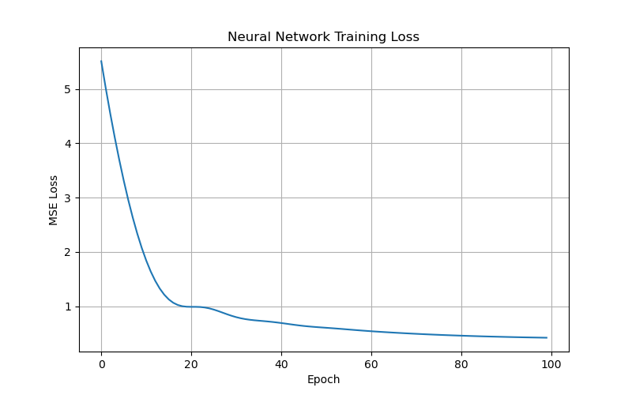

# California Housing Dataset Exploration

## How to Run

1. Install the required libraries:

```bash
pip install pandas scikit-learn torch matplotlib tabulate
```

2. Run the Python script:

```bash
python hw2.py
```

3. The program will:
   - Load and explore the California Housing dataset.
   - Split and scale the data.
   - Train a Linear Regression model.
   - Train a PyTorch Neural Network model.
   - Evaluate both models using MSE and RMSE.
   - Generate a loss plot (lossPlot.png).
   - Generate this README.md file.

---

## Dataset Description

```
.. _california_housing_dataset:

California Housing dataset
--------------------------

**Data Set Characteristics:**

:Number of Instances: 20640

:Number of Attributes: 8 numeric, predictive attributes and the target

:Attribute Information:
    - MedInc        median income in block group
    - HouseAge      median house age in block group
    - AveRooms      average number of rooms per household
    - AveBedrms     average number of bedrooms per household
    - Population    block group population
    - AveOccup      average number of household members
    - Latitude      block group latitude
    - Longitude     block group longitude

:Missing Attribute Values: None

This dataset was obtained from the StatLib repository.
https://www.dcc.fc.up.pt/~ltorgo/Regression/cal_housing.html

The target variable is the median house value for California districts,
expressed in hundreds of thousands of dollars ($100,000).

This dataset was derived from the 1990 U.S. census, using one row per census
block group. A block group is the smallest geographical unit for which the U.S.
Census Bureau publishes sample data (a block group typically has a population
of 600 to 3,000 people).

A household is a group of people residing within a home. Since the average
number of rooms and bedrooms in this dataset are provided per household, these
columns may take surprisingly large values for block groups with few households
and many empty houses, such as vacation resorts.

It can be downloaded/loaded using the
:func:`sklearn.datasets.fetch_california_housing` function.

.. rubric:: References

- Pace, R. Kelley and Ronald Barry, Sparse Spatial Autoregressions,
  Statistics and Probability Letters, 33:291-297, 1997.

```

## First 5 Rows

   MedInc  HouseAge  AveRooms  AveBedrms  Population  AveOccup  Latitude  Longitude  MedHouseVal
0  8.3252      41.0  6.984127   1.023810       322.0  2.555556     37.88    -122.23        4.526
1  8.3014      21.0  6.238137   0.971880      2401.0  2.109842     37.86    -122.22        3.585
2  7.2574      52.0  8.288136   1.073446       496.0  2.802260     37.85    -122.24        3.521
3  5.6431      52.0  5.817352   1.073059       558.0  2.547945     37.85    -122.25        3.413
4  3.8462      52.0  6.281853   1.081081       565.0  2.181467     37.85    -122.25        3.422

## Summary Statistics

   MedInc  HouseAge  AveRooms  AveBedrms  Population  AveOccup  Latitude  Longitude  MedHouseVal
0  8.3252      41.0  6.984127   1.023810       322.0  2.555556     37.88    -122.23        4.526
1  8.3014      21.0  6.238137   0.971880      2401.0  2.109842     37.86    -122.22        3.585
2  7.2574      52.0  8.288136   1.073446       496.0  2.802260     37.85    -122.24        3.521
3  5.6431      52.0  5.817352   1.073059       558.0  2.547945     37.85    -122.25        3.413
4  3.8462      52.0  6.281853   1.081081       565.0  2.181467     37.85    -122.25        3.422

# Model Evaluation

| Model | MSE | RMSE |
|-------|------|------|
| Linear Regression | 0.5290 | 0.7273 |
| Neural Network | 0.4265 | 0.6530 |

## Analysis

The Neural Network performed better because it achieved lower MSE and RMSE values on the test set. Lower values indicate that the model's predictions were closer to the actual house values.

## Neural Network Loss Curve



### Loss Analysis

The training loss decreased as the number of epochs increased, indicating that the neural network was learning from the training data. The largest reduction in loss occurred during the early epochs, followed by smaller improvements as training continued. This behavior suggests that the model was converging toward a stable solution and improving its predictive performance over time.
